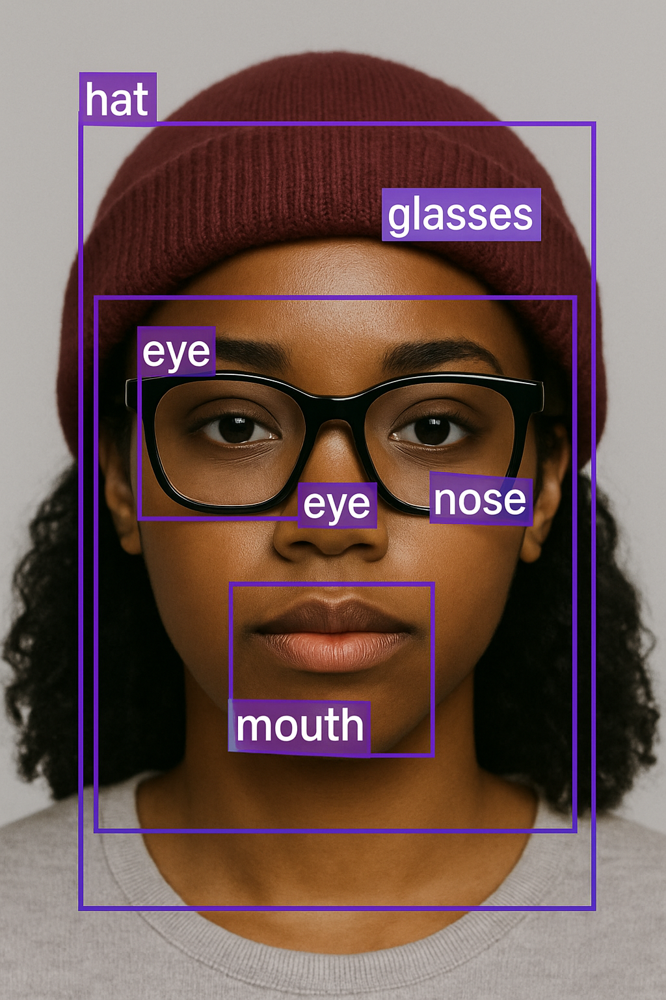

## YOLO-Face-4-KYC

A fine-tuned YOLO model for detecting facial features and personal headwear, including glasses, hats, and masks — optimized for identity verification and KYC applications.

### Overview

This project provides a specialized YOLO (You Only Look Once) model that has been fine-tuned for accurate detection of facial features and personal headwear. It is specifically designed for identity verification and Know Your Customer (KYC) applications to detect headwearing object during liveness verification:

- Facial features
- Glasses
- Hats
- Masks
- 
## Requirements

- Python 3.8+
- PyTorch
- CUDA (for GPU acceleration)

